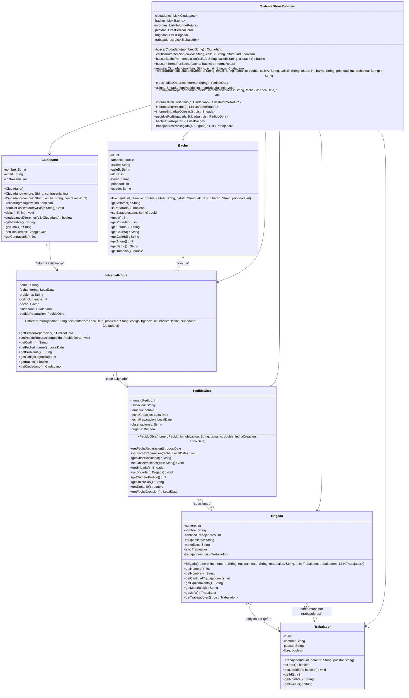
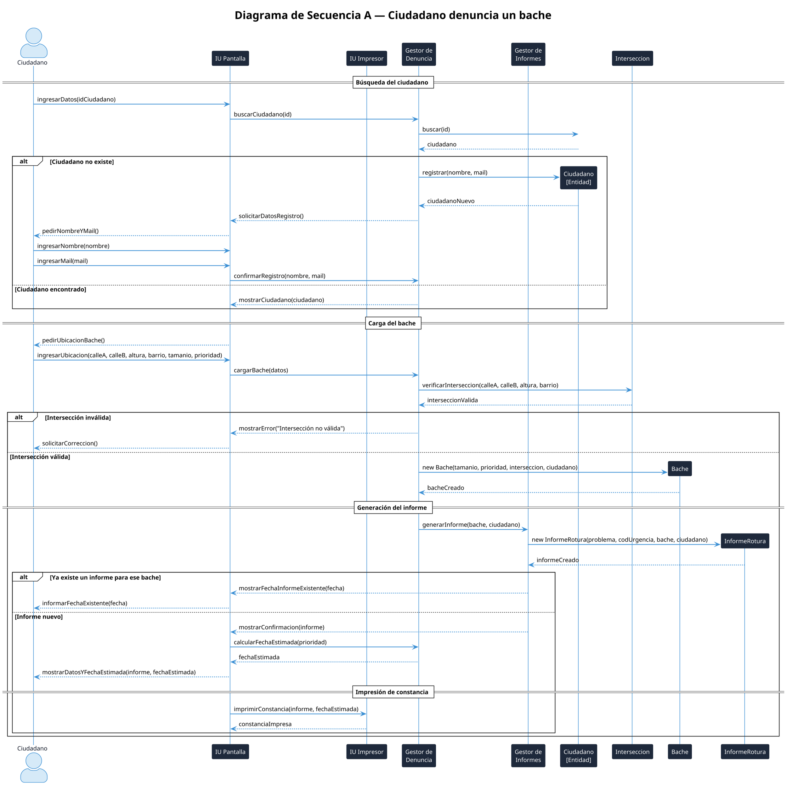
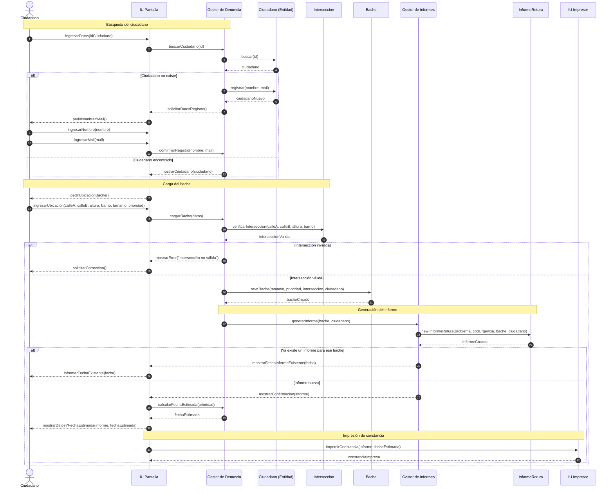
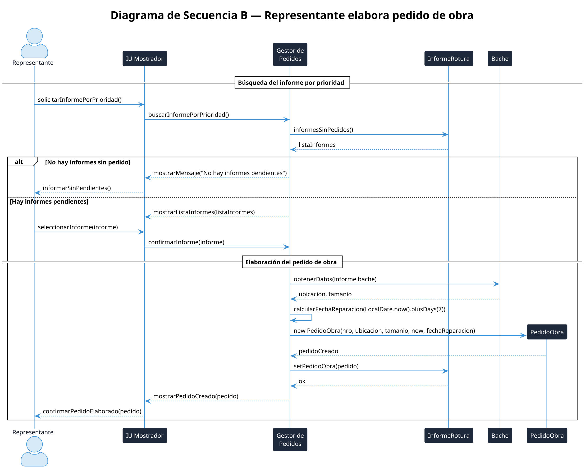
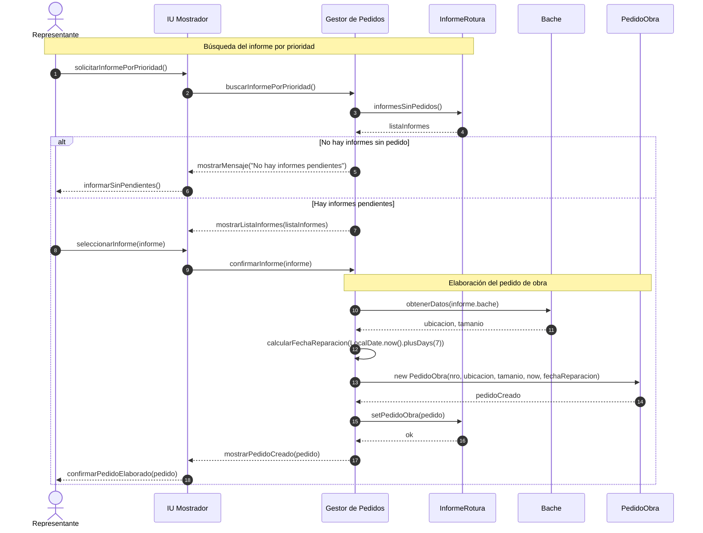
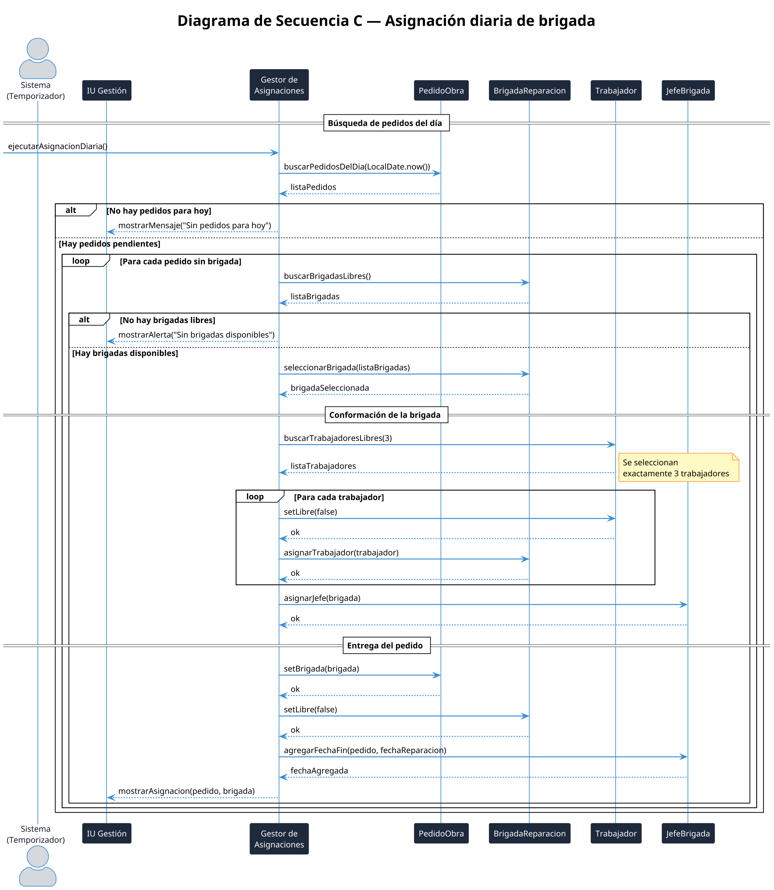
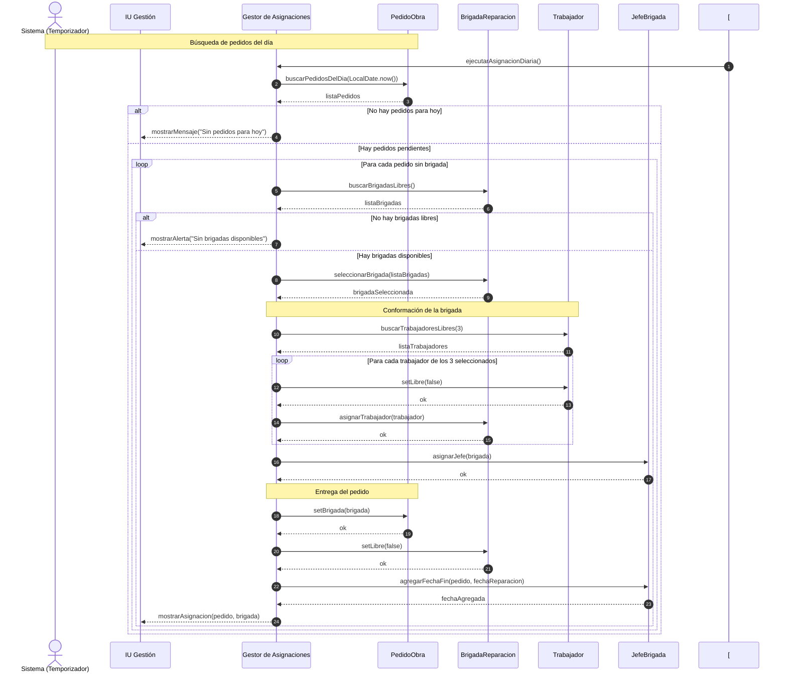

# Diagramas del Sistema - Gestión de Baches

Este documento contiene los diagramas del sistema de gestión de baches del Departamento de Obras Públicas.

## 1. Diagrama de Clases Completo

---

## 2. Diagramas de Secuencia

En esta sección se presentan los diagramas de secuencia utilizando tanto la notación **PlantUML** (con patrones de diseño Boundary-Control-Entity) como su representación equivalente en **Mermaid** para visualización directa en Markdown.

### Caso A: Ciudadano denuncia un bache

#### PlantUML

#### Mermaid

---

### Caso B: Representante elabora pedido de obra

#### PlantUML

#### Mermaid

---

### Caso C: Asignación diaria de brigada

#### PlantUML

#### Mermaid

