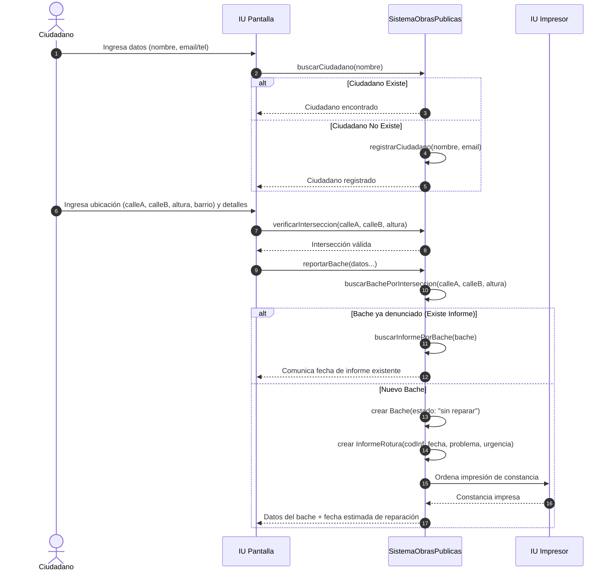
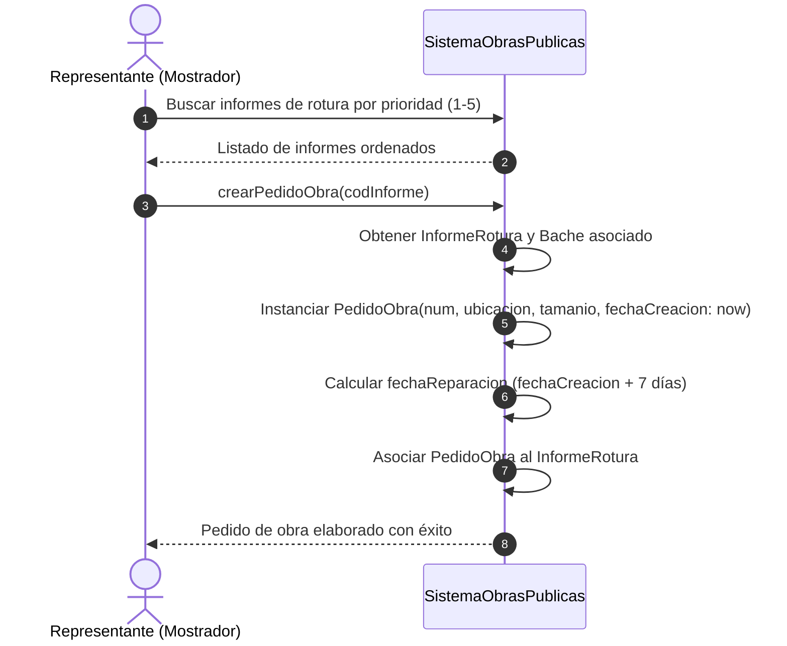
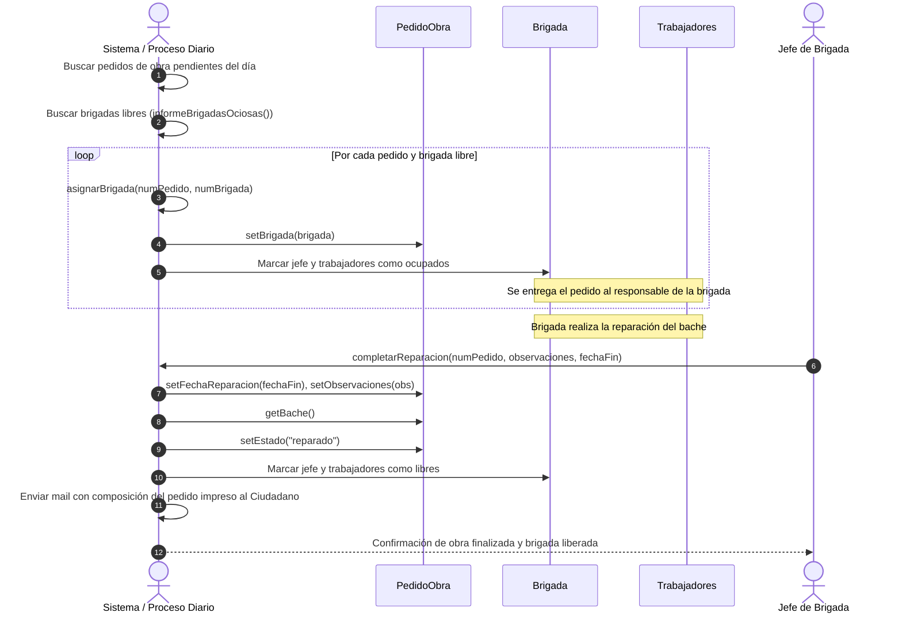

# Diagramas del Sistema - Gestión de Baches

Este documento contiene los diagramas del sistema de gestión de baches del Departamento de Obras Públicas.

## 1. Diagrama de Clases Completo

---

## 2. Diagramas de Secuencia

### Caso A: Ciudadano denuncia un bache

### Caso B: Elaboración de Pedido de Obra por Prioridad

### Caso C: Asignación Diaria de Brigadas y Ejecución de Obra

